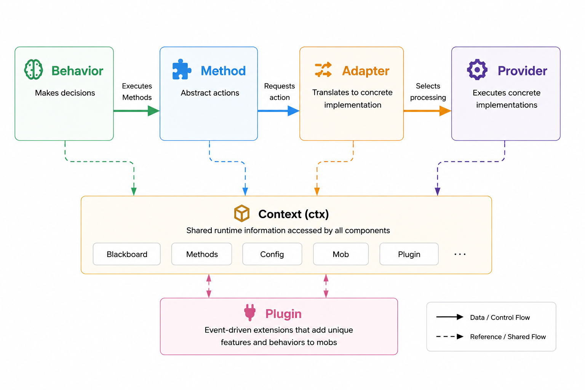
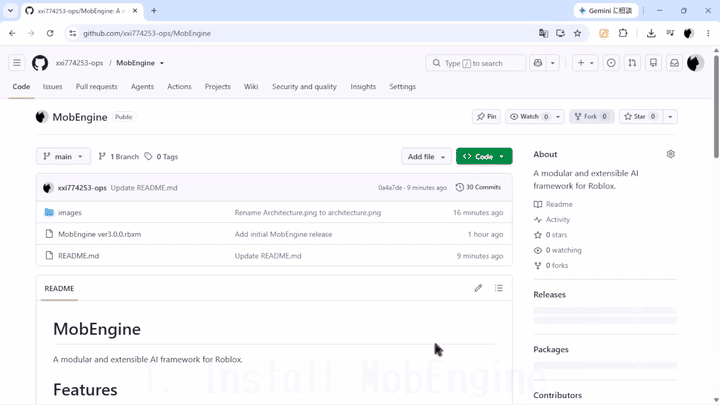

# MobEngine

A modular and extensible AI framework for Roblox.

## Contents

- [Features](#features)
- [Core Concepts](#core-concepts)
- [Components](#components)
- [Component Flow](#component-flow)
- [Quick Start](#quick-start)
- [Best Practices](#best-practices)
- [API Reference](#api-reference)
- [Examples](#examples)
  - [Example 1: Zombie](#example-1-zombie)
  - [Example 2: Wolf](#example-2-wolf)
  - [Example 3: Werewolf](#example-3-werewolf)
- [Installation](#installation)

---

# Features

このライブラリでは、主に5つのような機能を提供しています。

- **柔軟な行動システム**

  Behavior TreeやUtility AI、State Machineなど、自分の好きなAI方式をBehaviorとして実装できます。

- **抽象化された行動用関数**

  `Move()`や`Search()`などのMethodによって、AIの意思決定と実際の処理を分離できます。

- **強力な挙動管理システム**

  同じMethodでも、状況や環境に応じて実行する処理を柔軟に変更できます。

- **Luauの型サポート**

  ライブラリ内部で厳密な型定義を行っているため、Roblox Studio上で型推論や自動補完を活用できます。

- **高い拡張性**

  モブAIだけでなく、NPC、武器、スキルなど、様々なゲームシステムへ応用できます。

---

# Core Concepts

MobEngineでは、以下の要素を中心にAIを構成します。

- **Engine**
  
  MobEngine全体を管理し、各コンポーネントの作成・登録やMobの生成を行う中心的な要素。

- **Behavior**
  
  このライブラリにおける**意思決定**を行う要素。

- **Method**
  
  Behaviorから使用される**抽象的な行動**を定義する要素。

- **Adapter**
  
  Methodで指定された**抽象的な行動**を**具体的な処理**へ翻訳する、いわば「翻訳機」のような要素。

- **Provider**
  
  Adapterによって選択された**具体的な処理**を実際に実行する要素。

- **Plugin**
  
  イベント駆動によってモブに**独自の機能や振る舞い**を追加する拡張要素。

## Component Flow

MobEngineでは、基本的に以下のような流れで処理が行われます。

```text
┌──────────┐
│ Behavior │
└────┬─────┘
     │
     │ Method
     ▼
┌──────────┐
│  Method  │
└────┬─────┘
     │
     │ Adapter
     ▼
┌──────────┐
│ Adapter  │
└────┬─────┘
     │
     │ Provider
     ▼
┌──────────┐
│ Provider │
└──────────┘

Plugin
  │
  └── Event-driven extensions
````



---

# Components

**Core Concepts**で紹介した各コンポーネントについて、ここから詳しく解説します。

まず、これ以降の説明で多用する`ctx`について説明します。

```luau
ctx = {
	Blackboard = {},
	Methods = {},
	Config = {},
	Mob = {
		Model = nil,
		Humanoid = nil,
		RootPart = nil,
	},
	Plugin = {
		SendEventAsync = function() end,
		InvokeEvent = function() end,
	},
}
```

## Behavior

BehaviorはMobEngineにおける意思決定を担当します。

BehaviorにはBehavior Tree、Utility AI、State Machineなど、様々なAI方式を使用できます。

### BehaviorInstance

Behaviorを作成すると`BehaviorInstance`が返されます。

### API

#### `MobEngine.createBehavior(Behavior)`

Behaviorを作成します。

```luau
local behavior = MobEngine.createBehavior(function(ctx)
	-- Behavior
end)
```

Engineから作成することもできます。

```luau
local behavior = engine.createBehavior(function(ctx)
	-- Behavior
end)
```

Engineから作成した場合、Engineが持つ型情報を利用できるため、より正確な型推論や自動補完を利用できます。

---

## Method

MethodはBehaviorなどから使用される、**抽象的な行動**を定義します。

Behaviorは具体的な処理を直接実行せず、Methodを通して行動を要求します。

### MethodInstance

Methodを作成すると`MethodInstance`が返されます。

### API

#### `MobEngine.createMethod(MethodName)`

Methodを作成します。

```luau
local Move = MobEngine.createMethod("Move")
```

Engineから作成することもできます。

```luau
local Move = engine.createMethod("Move")
```

Engineから作成した場合、Engineが持つ型情報を利用できます。

---

## Adapter

AdapterはMethodで指定された抽象的な行動を、具体的な処理へ変換します。

同じMethodでも、Mobの状態や環境などに応じて異なるProviderの処理を選択できます。

### AdapterInstance

Adapterを作成すると`AdapterInstance`が返されます。

### API

#### `MobEngine.createAdapter(AdapterName, Methods)`

Adapterを作成します。

```luau
local adapter = MobEngine.createAdapter(
	"Ground",
	{
		[Methods.Move] = "Move",
	}
)
```

Engineから作成することもできます。

```luau
local adapter = engine.createAdapter(
	"Ground",
	{
		[Methods.Move] = "Move",
	}
)
```

#### `engine:registerAdapter(Adapter)`

AdapterをEngineに登録します。

```luau
engine:registerAdapter(adapter)
```

---

## Provider

Providerは具体的な処理を実際に実行します。

Providerはゲームや環境ごとの実装を担当します。

### ProviderInstance

Providerを作成すると`ProviderInstance`が返されます。

### API

#### `MobEngine.createProvider(ProviderName, Methods)`

Providerを作成します。

```luau
local provider = MobEngine.createProvider(
	"Ground",
	{
		Move = function(ctx, position)
			-- 実際の処理
		end,
	}
)
```

Engineから作成することもできます。

```luau
local provider = engine.createProvider(
	"Ground",
	{
		Move = function(ctx, position)
			-- 実際の処理
		end,
	}
)
```

#### `engine:registerProvider(Provider)`

ProviderをEngineに登録します。

```luau
engine:registerProvider(provider)
```

---

## Plugin

Pluginはイベント駆動によってMobに独自の機能や振る舞いを追加します。

BehaviorやProvider本体に直接処理を追加するのではなく、イベントを通して独自処理を拡張できます。

### PluginInstance

Pluginを作成すると`PluginInstance`が返されます。

### API

#### `MobEngine.createPlugin(Events)`

Pluginを作成します。

```luau
local plugin = MobEngine.createPlugin({
	OnAttacked = function(ctx)
		-- イベント処理
	end,
})
```

Engineから作成することもできます。

```luau
local plugin = engine.createPlugin({
	OnAttacked = function(ctx)
		-- イベント処理
	end,
})
```

### Events

#### `SendEventAsync(EventName, ...)`

イベントを非同期で実行します。

```luau
ctx.Plugin.SendEventAsync("OnSomething")
```

イベントの処理を待機せず、呼び出し元の処理を続行します。

#### `InvokeEvent(EventName, ...)`

イベントを同期的に実行します。

```luau
local result = ctx.Plugin.InvokeEvent("OnSomething")
```

イベント処理が完了するまで待機し、戻り値を受け取ることができます。

---

# Quick Start

ここでは、MobEngineを使って簡単なMob AIを構築します。

この例では、Mobがプレイヤーを探索し、ターゲットが見つかった場合にその方向へ移動するシンプルなAIを作成します。

---

## 1. Blackboardを定義する

まず、Mobごとに保持するランタイムデータを定義します。

```luau
local Blackboard = {
	Target = nil :: Player?,
}
```

`Blackboard`はMobごとにコピーされるため、各Mobが独立した状態を持つことができます。

---

## 2. Methodを定義する

Behaviorから使用する抽象的な行動を定義します。

```luau
local Methods = {
	Search = MobEngine.createMethod("Search"),
	Move = MobEngine.createMethod("Move"),
}
```

ここでは、

* `Search` — ターゲットを探す
* `Move` — ターゲットへ移動する

という2つのMethodを定義しています。

---

## 3. Configを定義する

Mobが使用するデフォルト設定を定義します。

```luau
local DefaultConfig = {
	SearchRange = 60,
	Speed = 12,
}
```

ConfigはMobごとにコピーされるため、個体ごとに設定を変更できます。

---

## 4. Engineを作成する

定義したBlackboard、Methods、Configを使ってEngineを作成します。

```luau
local engine = MobEngine.createEngine(
	Blackboard,
	Methods,
	DefaultConfig
)
```

Engineを作成すると、Engineが持つ型情報を利用して各コンポーネントを作成できるようになります。

---

## 5. Providerを作成する

次に、Methodの具体的な処理をProviderに実装します。

```luau
local GroundProvider = engine.createProvider(
	"Ground",
	{
		Search = function(ctx)
			local character = ctx.Mob.Model
			if not character then
				return
			end

			local players = game:GetService("Players")

			local closestPlayer = nil
			local closestDistance = ctx.Config.SearchRange

			for _, player in players:GetPlayers() do
				local playerCharacter = player.Character
				local rootPart = playerCharacter
					and playerCharacter.PrimaryPart

				if rootPart then
					local distance = (
						rootPart.Position - ctx.Mob.RootPart.Position
					).Magnitude

					if distance <= closestDistance then
						closestPlayer = player
						closestDistance = distance
					end
				end
			end

			ctx.Blackboard.Target = closestPlayer
		end,

		Move = function(ctx, position)
			local humanoid = ctx.Mob.Humanoid
			if not humanoid then
				return
			end

			humanoid.WalkSpeed = ctx.Config.Speed
			humanoid:MoveTo(position)
		end,
	}
)
```

Providerでは、`Search()`や`Move()`が実際に何をするのかを実装します。

---

## 6. Adapterを作成する

次に、MethodとProviderの処理を接続します。

```luau
local GroundAdapter = engine.createAdapter(
	"Ground",
	{
		[Methods.Search] = "Search",
		[Methods.Move] = "Move",
	}
)
```

これにより、

```text
Methods.Search → GroundProvider.Search
Methods.Move   → GroundProvider.Move
```

という接続が作られます。

---

## 7. ProviderとAdapterを登録する

作成したProviderとAdapterをEngineへ登録します。

```luau
engine:registerProvider(GroundProvider)
engine:registerAdapter(GroundAdapter)
```

---

## 8. Behaviorを作成する

次に、Mobの意思決定をBehaviorとして定義します。

```luau
local behavior = engine.createBehavior(function(ctx)
	while task.wait(0.1) do
		ctx.Methods.Search()

		local target = ctx.Blackboard.Target

		if target then
			local character = target.Character
			local rootPart = character and character.PrimaryPart

			if rootPart then
				ctx.Methods.Move(rootPart.Position)
			end
		end
	end
end)
```

Behaviorでは具体的な移動処理を直接実装していません。

```luau
ctx.Methods.Move(position)
```

とすることで、実際の移動処理はAdapterとProviderに任せています。

---

## 9. BehaviorをEngineに読み込む

作成したBehaviorをEngineに読み込みます。

```luau
engine:loadBehavior(behavior)
```

これで、Engineから作成されるMobがこのBehaviorを使用するようになります。

---

## 10. Mobを作成する

Modelを指定してMobを作成します。

```luau
local mob = engine:createMob(
	Model,
	{ "Ground" },
	{}
)
```

`"Ground"`は、先ほど登録したProvider / Adapterの名前です。

3つ目の引数には個体ごとのConfigを指定できます。

例えば、通常より速いMobを作成する場合は、

```luau
local fastMob = engine:createMob(
	Model,
	{ "Ground" },
	{
		Speed = 20,
	}
)
```

のようにできます。

---

## 11. Mobを実行する

最後にBehaviorを実行します。

```luau
mob:Run()
```

これでMobは、

```text
Behavior
   ↓
Search Method
   ↓
Ground Adapter
   ↓
Ground Provider
   ↓
ターゲットを検索
```

そしてターゲットが見つかると、

```text
Behavior
   ↓
Move Method
   ↓
Ground Adapter
   ↓
Ground Provider
   ↓
Humanoid:MoveTo()
```

という流れで処理を実行します。

---

## 完成した構成

最終的な構成は以下のようになります。

```text
Blackboard
    │
    ▼
  Engine
    │
    ├── Methods
    │     ├── Search
    │     └── Move
    │
    ├── Provider
    │     └── Ground
    │           ├── Search
    │           └── Move
    │
    ├── Adapter
    │     └── Ground
    │           ├── Search → Search
    │           └── Move   → Move
    │
    └── Behavior
          │
          ├── Search()
          │
          └── Move()
```

このようにMobEngineでは、**Behaviorが意思決定を行い、Method → Adapter → Providerという流れで具体的な処理を実行します。**

同じBehaviorでもAdapterやProviderを変更することで、異なる環境や実装へ再利用できます。

# Best Practices

## Keep Methods Abstract

Methodには具体的な処理を書かず、**「何をするか」だけを定義する**ようにします。

```luau
ctx.Methods.Move(position)
```

`Move()`の中で直接`Humanoid:MoveTo()`などを実行するのではなく、具体的な処理はProviderに任せます。

これにより、同じBehaviorを異なる環境や実装で再利用できます。

---

## Let Adapters Handle Context

Adapterは、MethodをどのProviderの処理へ接続するかを決定します。

```luau
local adapter = engine.createAdapter(
	"Ground",
	{
		[Methods.Move] = function(ctx)
			if ctx.Blackboard.Target then
				return "Run"
			end

			return "Walk"
		end,
	}
)
```

このようにAdapterを利用することで、Behaviorを変更せずに状況に応じた処理の切り替えができます。

---

## Keep Providers Focused

Providerでは、実際のゲーム処理に集中させます。

例えば、

* 移動
* 攻撃
* ターゲット探索
* アニメーション
* パス検索

などの具体的な処理をProviderとして分離できます。

---

## Reuse Behaviors

Behaviorは可能な限り汎用的に設計します。

例えば、

```luau
ctx.Methods.Move(position)
```

というMethodを使用するBehaviorを作っておけば、Ground用ProviderやFlying用Providerなど、異なる実装へ接続できます。

---

## Use Config for Individual Differences

Mobごとの違いは、可能な限りConfigで調整します。

```luau
local wolf = engine:createMob(
	Model,
	{ "Ground", "Search", "Melee" },
	{
		Speed = 20,
	}
)
```

これにより、同じBehaviorやProviderを再利用しながら、個体ごとの性能を変更できます。

---

## Use Plugins for Extensions

既存のBehaviorやProviderへ直接機能を追加するのではなく、独立したイベント処理として追加できる場合はPluginを使用します。

```luau
local plugin = engine.createPlugin({
	OnAttacked = function(ctx)
		-- 独自処理
	end,
})
```

これにより、既存のAI構造を変更せずにMob固有の機能を追加できます。

---

# API Reference

MobEngineでは、`MobEngine`と`Engine`の両方から各コンポーネントを作成できます。

```luau
MobEngine.createMethod()
MobEngine.createProvider()
MobEngine.createAdapter()
MobEngine.createBehavior()
MobEngine.createPlugin()
```

また、Engineからも同じAPIを利用できます。

```luau
engine.createMethod()
engine.createProvider()
engine.createAdapter()
engine.createBehavior()
engine.createPlugin()
```

Engineから作成する場合、`createEngine()`で渡した型情報を利用できるため、Roblox Studio上でより正確な型推論や自動補完を利用できます。

---

## MobEngine

### `MobEngine.createMethod(MethodName)`

`MethodInstance`を作成します。

```luau
local Move = MobEngine.createMethod("Move")
```

### `MobEngine.createProvider(ProviderName, Methods)`

`ProviderInstance`を作成します。

```luau
local provider = MobEngine.createProvider(
	"Ground",
	{
		Move = function(ctx, position)
			-- ...
		end,
	}
)
```

### `MobEngine.createAdapter(AdapterName, Methods)`

`AdapterInstance`を作成します。

```luau
local adapter = MobEngine.createAdapter(
	"Ground",
	{
		[Methods.Move] = "Move",
	}
)
```

### `MobEngine.createBehavior(Behavior)`

`BehaviorInstance`を作成します。

```luau
local behavior = MobEngine.createBehavior(function(ctx)
	-- ...
end)
```

### `MobEngine.createPlugin(Events)`

`PluginInstance`を作成します。

```luau
local plugin = MobEngine.createPlugin({
	OnSomething = function(ctx)
		-- ...
	end,
})
```

### `MobEngine.createEngine(Blackboard, Methods, DefaultConfig)`

`Engine`を作成します。

```luau
local engine = MobEngine.createEngine(
	Blackboard,
	Methods,
	DefaultConfig
)
```

---

## Engine

### `engine.createMethod(MethodName)`

`MethodInstance`を作成します。

Engineが保持する型情報を利用できます。

```luau
local Move = engine.createMethod("Move")
```

### `engine.createProvider(ProviderName, Methods)`

`ProviderInstance`を作成します。

```luau
local provider = engine.createProvider(
	"Ground",
	{
		Move = function(ctx, position)
			-- ...
		end,
	}
)
```

### `engine.createAdapter(AdapterName, Methods)`

`AdapterInstance`を作成します。

```luau
local adapter = engine.createAdapter(
	"Ground",
	{
		[Methods.Move] = "Move",
	}
)
```

### `engine.createBehavior(Behavior)`

`BehaviorInstance`を作成します。

```luau
local behavior = engine.createBehavior(function(ctx)
	-- ...
end)
```

### `engine.createPlugin(Events)`

`PluginInstance`を作成します。

```luau
local plugin = engine.createPlugin({
	OnSomething = function(ctx)
		-- ...
	end,
})
```

### `engine:registerProvider(Provider)`

ProviderをEngineへ登録します。

```luau
engine:registerProvider(provider)
```

### `engine:registerAdapter(Adapter)`

AdapterをEngineへ登録します。

```luau
engine:registerAdapter(adapter)
```

### `engine:loadBehavior(Behavior)`

BehaviorをEngineへ読み込みます。

```luau
engine:loadBehavior(behavior)
```

### `engine:createMob(Model, Providers, Config, Plugin)`

Mobを作成します。

```luau
local mob = engine:createMob(
	Model,
	{ "Ground", "Search", "Melee" },
	{
		Damage = 20,
	},
	plugin
)
```

#### Parameters

| 引数          | 説明               |
| ----------- | ---------------- |
| `Model`     | Mobとして使用するModel  |
| `Providers` | 使用するProvider名の配列 |
| `Config`    | 個体ごとのConfig      |
| `Plugin`    | 個体に追加するPlugin    |

---

## MobInstance

### `mob:Run()`

Mobに読み込まれたBehaviorを実行します。

```luau
mob:Run()
```

---

## Context

Behavior・Provider・Pluginなどから使用できる`ctx`には、Mobの実行に必要な情報が格納されています。

```luau
ctx = {
	Blackboard = {},
	Methods = {},
	Config = {},
	Mob = {},
	Plugin = {},
}
```

### `ctx.Blackboard`

Mobごとに保持されるランタイムデータです。

```luau
ctx.Blackboard.Target
```

### `ctx.Methods`

Behaviorなどから使用するMethodの集合です。

```luau
ctx.Methods.Move(position)
ctx.Methods.Attack()
```

### `ctx.Config`

MobごとのConfigです。

```luau
ctx.Config.Damage
ctx.Config.AttackRange
```

### `ctx.Mob`

現在のMobに関する情報です。

```luau
ctx.Mob.Model
ctx.Mob.Humanoid
ctx.Mob.RootPart
```

### `ctx.Plugin`

Pluginのイベントを実行するためのAPIです。

#### `ctx.Plugin.SendEventAsync(EventName, ...)`

イベントを非同期で実行します。

```luau
ctx.Plugin.SendEventAsync("OnSomething")
```

#### `ctx.Plugin.InvokeEvent(EventName, ...)`

イベントを同期的に実行し、結果を受け取ります。

```luau
local result = ctx.Plugin.InvokeEvent("OnSomething")
```

---

# Examples

## Example 1: Zombie

基本的なMob AIを構築します。

この例では、`Search()`と`Move()`を使用し、Adapterによって状況に応じた移動処理を切り替えています。

### What This Example Demonstrates

* Behaviorによる意思決定
* Methodによる行動の抽象化
* Adapterによる処理の切り替え
* Providerによる具体的な処理
* BlackboardによるMobごとの状態管理

[Full Example](examples/zombie.luau)

---

## Example 2: Wolf

Example 1のZombie AIを発展させ、攻撃行動を追加します。

`Search()`と`Move()`に加えて`Attack()`を追加し、`MeleeProvider`によって攻撃処理を実装します。

### What This Example Demonstrates

* 複数のMethodを組み合わせたAI
* 攻撃処理のProvider化
* `AttackRange`による攻撃範囲
* `AttackCooldown`による攻撃間隔
* `Damage`による攻撃力
* Configによる個体差

[Full Example](examples/wolf.luau)

---

## Example 3: Werewolf

Example 2のWolfをさらに発展させ、Pluginと個体Configを追加します。

攻撃成功時に`OnAttacked`イベントを発生させ、Plugin側で独自の処理を実行します。

また、Wolfと同じBehaviorやProviderを再利用しながら、ConfigによってWerewolfの性能を変更しています。

### What This Example Demonstrates

* Pluginによる独自機能の追加
* Event-drivenな拡張
* `InvokeEvent()`による同期イベント
* 個体ごとのConfig変更
* 共通AI構造の再利用

[Full Example](examples/werewolf.luau)

---

# Installation

1. GitHubから`MobEngine.rbxm`をダウンロードします。
2. ライブラリを使用したいRoblox Studioを開きます。
3. **「Robloxモデルをインポート」**から`MobEngine.rbxm`をインポートします。



これでインストールは完了です。
